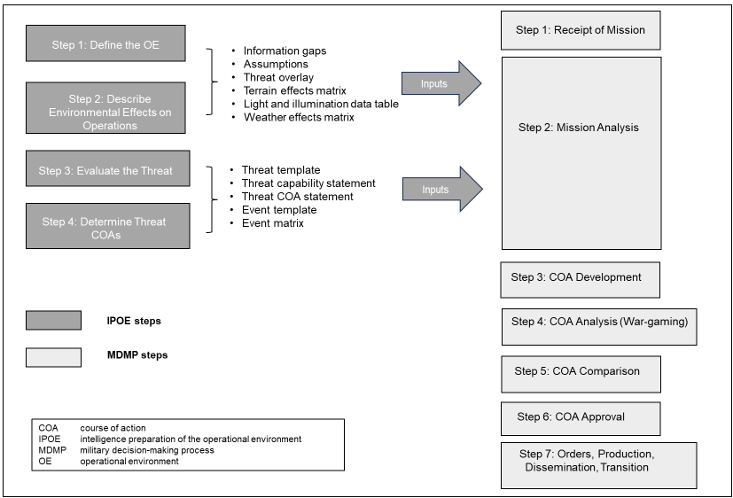

## AMD Operational Elements

Air and Missile Defense consists of two operational elements: **Active AMD** and **Passive AMD**.

### Active AMD

**Active AMD** consists of direct defensive actions taken to destroy, nullify, or reduce the effectiveness of air and missile threats against friendly forces and assets.

### Passive AMD

**Passive AMD** consists of all measures, other than active AMD, taken to minimize the effectiveness of hostile air and ballistic missile threats against friendly forces and critical assets.

Passive measures include:

- Detection and warning
- Camouflage
- Concealment
- Deception
- Dispersion
- Hardening
- Protective construction

> **Quick recall:** The two AMD operational elements are **Active** and **Passive**.

## AMD Principles

Commanders apply AMD principles when planning active AMD operations. The AMD principles are:

1. **Mass**
2. **Mix**
3. **Mobility**
4. **Integration**
5. **Flexibility**
6. **Agility**

### Mass

**Mass** is the concentration of combat power sufficient to achieve the commander's intent. For AMD, mass is achieved by allocating enough AMD firepower to successfully defend the force or asset against aerial attack or surveillance. Massing AMD combat power in one area may require commanders to accept risk in another area.

### Mix

**Mix** is the employment of a combination of weapons and sensors to protect the force and assets from the threat. Mix offsets the limitations of one system with the capabilities of another and complicates the situation for the attacker.

### Mobility

**Mobility** is the capability of military forces to move from place to place while retaining the ability to fulfill their primary mission. Mobility also increases the survivability of AMD forces and the assets they support.

### Integration

**Integration** is the arrangement of military forces and their actions to create a force that operates by engaging as a whole. In AMD, integration combines ADA and joint counterair forces, systems, functions, processes, and information acquisition and distribution so they can operate singly or together without adversely affecting individual elements.

### Flexibility

**Flexibility** is the employment of a versatile mix of capabilities, formations, and equipment for conducting operations. In AMD, flexibility is applied primarily by building **METT-TC-informed task organizations**.

### Agility

**Agility** is the ability of friendly forces to react faster than the enemy. For AMD, this includes leveraging digital capabilities and continuous air IPB to maneuver and employ forces inside the enemy's decision space.

## AMD Employment Tenets

AMD employment tenets are desirable attributes that commanders should build into plans when positioning and employing ADA resources.

### Mutual Support

Weapons are positioned so the fires of one weapon can engage targets within the **dead zone of an adjacent weapon**. The same concept applies to sensors: sensors are positioned to cover the dead zones of adjacent sensors.

### Overlapping Fires and Overlapping Coverage

Weapons are positioned so their **engagement envelopes overlap** vertically and horizontally. Sensors are positioned so their coverage leaves **no seam in the defense** that an incoming threat could exploit.

### Balanced Fires

Weapons are positioned to deliver an **equal volume of fires in all directions**. This is useful when terrain does not canalize the threat or when avenues of approach are unpredictable.

### Weighted Coverage

Weapons coverage is combined and concentrated toward the **most likely threat air avenues of approach or directions of attack**. A commander may accept risk in one direction to weight coverage toward another direction.

> **Remember:** **Balanced fires** and **weighted coverage** are not mutually achievable; emphasizing one requires giving up most aspects of the other.

### Early Engagement

Sensors and weapons are positioned so they can engage the threat **before ordnance release or before friendly forces are detected**. Early engagement generally requires extending the defense away from the defended asset and may be achieved at the expense of balanced fires.

### Defense in Depth

Sensors and weapons are positioned so the threat is exposed to an **increasing volume of fire as it approaches the protected asset or force**. Defense in depth decreases the probability that attacking missiles, aircraft, or RAM will reach the defended asset or force.

### Resilience

**Resilience** is the ability of the defense to maintain continuity of operations despite changes in enemy tactics or losses of critical AMD components. ADA planners must account for defense-design adjustments as systems are attrited.

## Air Defense Warning

### DYNAMITE

Aircraft or missiles are inbound or attacking now.

- Response is **immediate**
- As a general rule, DYNAMITE should be assumed when an air threat is within **15 kilometers** of the division or brigade combat team's area of operations

### LOOKOUT

- Threat distance: **30 kilometers**

### SNOWMAN

- No aircraft or missiles pose a threat at this time

## Command Relationships

Command relationships describe the level of authority one commander has over a unit.

### Organic

A unit is **organic** when it is assigned to and forms an essential part of a military organization according to its table of organization.

> **Simple version:** The unit belongs there by design.

### Assigned

**Assigned** means placing a unit or personnel in an organization where the placement is relatively permanent.

> **Simple version:** The unit becomes part of that organization for the long term.

### Attached

**Attached** means placing a unit or personnel in an organization where the placement is relatively temporary.

> **Simple version:** The unit temporarily works as part of another organization.

### Operational Control (OPCON)

**Operational Control (OPCON)** gives a commander authority to:

- Organize and employ subordinate forces
- Assign tasks
- Designate objectives
- Give the direction necessary to accomplish the mission

OPCON is normally used when a unit is provided to another commander for a specific mission or task, often limited by **function, time, or location**.

OPCON does **not automatically include administrative or logistical control**. Those responsibilities must be specifically stated in the order.

The gaining ADA unit establishes command relationships, positions, and priorities.

> **Simple version:** OPCON means, "You work for me for this mission, and I can organize, task, and direct your unit to accomplish it."

### Tactical Control (TACON)

**Tactical Control (TACON)** is more limited than OPCON.

It gives a commander authority to direct and control the **movements and maneuvers** of a force within the operational area as needed to accomplish an assigned mission or task.

The gaining ADA unit establishes command relationships, positions, and priorities.

> **Simple version:** TACON means, "I can tell you where to move and what tactical actions to take for this mission, but I do not have the broader authority that comes with OPCON."

### Command Relationship Quick Comparison

| Relationship | Simple Meaning                                                             |
| ------------ | -------------------------------------------------------------------------- |
| **Organic**  | Permanently built into the organization                                    |
| **Assigned** | Placed in the organization relatively permanently                          |
| **Attached** | Placed in the organization temporarily                                     |
| **OPCON**    | Commander can organize, employ, task, and direct the force for the mission |
| **TACON**    | Commander can direct tactical movement and maneuver for the mission        |

## Support Relationships

Support relationships describe how one unit supports another unit or the force as a whole.

### Direct Support (DS)

A SHORAD unit in **Direct Support** provides dedicated air defense for a specific supported element.

- Supports a specific unit
- Provides close and continuous support
- Coordinates movement and positioning with the supported unit

> **Simple version:** One SHORAD unit is dedicated to supporting one specific element.

### General Support (GS)

A SHORAD unit in **General Support** provides air defense for the force as a whole.

- Not dedicated to one specific element
- Supports the overall force
- Commonly used to protect corps- and division-level assets

> **Simple version:** Support the whole force, not one particular unit.

### Reinforcing (R)

A SHORAD unit in a **Reinforcing** relationship increases the air defense coverage of another ADA unit.

- Augments another ADA unit
- Strengthens existing air defense coverage
- Protects priorities identified by the supported ADA commander

> **Simple version:** Help another ADA unit provide more or stronger coverage.

### General Support-Reinforcing (GSR)

A SHORAD unit in **General Support-Reinforcing** performs two roles:

1. Supports the force as a whole
2. Reinforces another ADA unit

The supporting unit coordinates with the reinforced ADA unit to strengthen coverage of assets in the area of operations.

> **Simple version:** Support the whole force while also helping another ADA unit.

### Support Relationship Quick Comparison

| Relationship                    | Primary Focus                                             |
| ------------------------------- | --------------------------------------------------------- |
| **Direct Support**              | One specific supported element                            |
| **General Support**             | The force as a whole                                      |
| **Reinforcing**                 | Strengthen another ADA unit                               |
| **General Support-Reinforcing** | Support the force while also reinforcing another ADA unit |

> **Remember:**  
> **Command relationship = who has authority over the unit.**  
> **Support relationship = who the unit supports and how.**

## Four-Step IPOE Process

1. **Define the Operational Environment**
2. **Describe the Environmental Effects on Operations**
3. **Evaluate the Threat**
4. **Determine Threat COAs**

## Quick Recall

### What are the two AMD operational elements?

- **Active AMD**
- **Passive AMD**

### What are the six AMD principles?

1. Mass
2. Mix
3. Mobility
4. Integration
5. Flexibility
6. Agility

### What are the AMD employment tenets?

1. Mutual Support
2. Overlapping Fires and Overlapping Coverage
3. Balanced Fires
4. Weighted Coverage
5. Early Engagement
6. Defense in Depth
7. Resilience

### What are the five command relationships covered in this lesson?

1. Organic
2. Assigned
3. Attached
4. Operational Control (OPCON)
5. Tactical Control (TACON)

### What is the difference between OPCON and TACON?

- **OPCON:** Broader authority to organize, employ, task, and direct a force to accomplish a mission
- **TACON:** More limited authority focused on tactical movement and maneuver for an assigned mission or task

### What are the four support relationships?

1. **Direct Support (DS)**
2. **General Support (GS)**
3. **Reinforcing (R)**
4. **General Support-Reinforcing (GSR)**

### What are the four steps of IPOE?

1. Define the Operational Environment
2. Describe the Environmental Effects on Operations
3. Evaluate the Threat
4. Determine Threat COAs

### What are the Air Defense Warning conditions?

- **DYNAMITE:** Aircraft or missiles inbound or attacking now — 15 km
- **LOOKOUT:** 30 km
- **SNOWMAN:** No aircraft or missiles pose a threat at this time

## Study Questions

1. What distinguishes DYNAMITE, LOOKOUT, and SNOWMAN?
2. What are the five command relationships covered in this lesson?
3. What is the difference between organic, assigned, and attached?
4. What authority does OPCON give a commander?
5. What does OPCON not automatically include?
6. How is TACON more limited than OPCON?
7. What are the four support relationships?
8. What is the difference between Direct Support and General Support?
9. What is the purpose of a Reinforcing relationship?
10. How does General Support-Reinforcing combine two support relationships?
11. What are the four steps of IPOE?
12. Why is consolidating gains continuously important?
