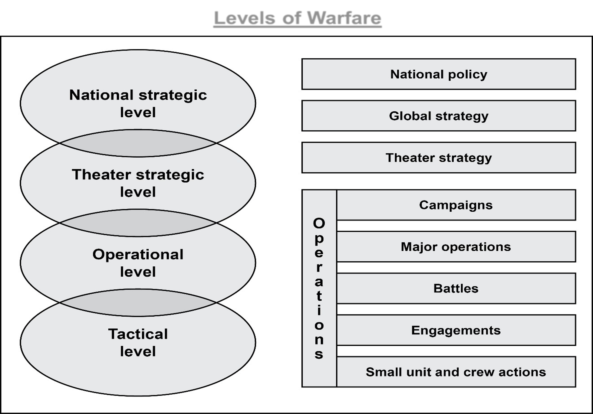
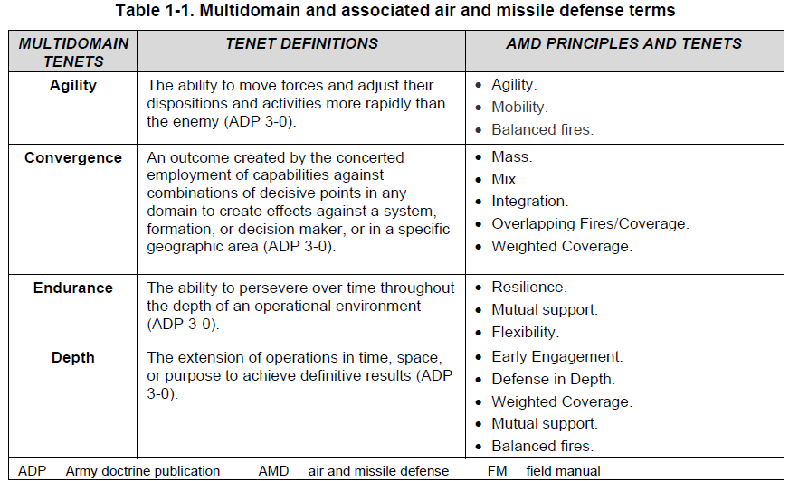
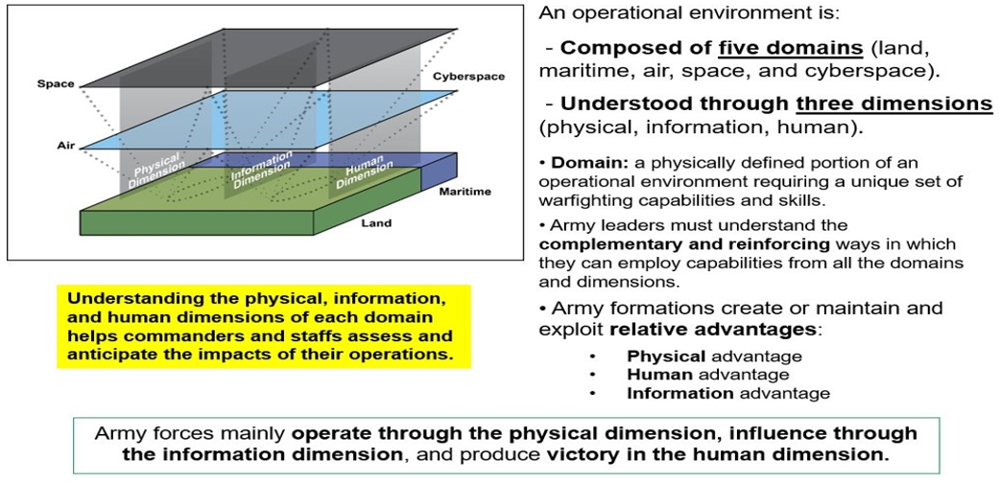

## Peer Threats

Peer threats possess:

- Advantages
- Capabilities
- Formations that contest the joint force through all domains
- Standoff approaches that increase risk to joint forces

## Threat Challenges

Enemy capabilities are:

- Dispersed across greater distances
- Distributed across all domains
- Employed beyond the bounds of armed conflict
- Vulnerable over shorter periods of time

These challenges allow China and Russia to disrupt the cohesion of the joint force.

## 2+3 Strategic Framework

### Acute Threat

- **Russia**

### Pacing Threat

- **China**

### Persistent Threats

- **North Korea**
- **Iran**
- **Violent extremists**

## Army Principle of War: Economy of Force

**Economy of Force** means to **expend minimum-essential combat power on secondary efforts to allocate the maximum possible combat power on the main effort**.

> **Quick recall:** Minimum essential combat power on secondary efforts; maximum possible combat power on the main effort.

## Levels of Warfare

The four levels of warfare are:

1. **National Strategic**
2. **Theater**
3. **Operational**
4. **Tactical**

## Four Tenets of Operations

The four tenets are:

1. **Agility**
2. **Convergence**
3. **Endurance**
4. **Depth**

### Convergence

**Convergence** is an outcome created by the concerted employment of capabilities from multiple domains and echelons against combinations of decisive points in any domain to create effects against a system, formation, decision maker, or in a specific geographic area.

## Imperatives of Operations

- See yourself, see the enemy, and **understand the operational environment**
- Account for being under **constant observation** and all forms of enemy contact
- Create and exploit relative physical, information, and human advantages in pursuit of **decision dominance**
- Make initial contact with the **smallest element possible**
- Impose **multiple dilemmas** on the enemy
- Anticipate, plan, and execute **transitions**
- Designate, weigh, and sustain the **main effort**
- **Consolidate gains** continuously
- Understand and manage the **effects of operations on units and Soldiers**

### Why make initial contact with the smallest element possible?

- Attempt to detect enemy forces with **unmanned sensors first**.
- Helps avoid **surprise and heavy losses** caused by enemy forces.
- Creates an opportunity to **rapidly employ forces** after contact is gained.
- **Exception:** Mass combat power against enemy forces when friendly forces possess the advantage of surprise.

## Operational Environment: Domains and Dimensions

An operational environment is composed of five domains:

1. **Land**
2. **Maritime**
3. **Air**
4. **Space**
5. **Cyberspace**

Each domain is understood through three dimensions:

- **Physical dimension**
- **Information dimension**
- **Human dimension**

## Quick Recall

### What is Economy of Force?

Expend **minimum-essential combat power on secondary efforts** to allocate the **maximum possible combat power on the main effort**.

### What is Convergence?

An outcome created by the **concerted employment of capabilities from multiple domains and echelons** against combinations of decisive points to create effects against a system, formation, decision maker, or specific geographic area.

### What are the five domains of the operational environment?

- Land
- Maritime
- Air
- Space
- Cyberspace

### What are the four tenets of operations?

- Agility
- Convergence
- Endurance
- Depth

### What are the four levels of warfare?

- National Strategic
- Theater
- Operational
- Tactical

### What is the 2+3 Strategic Framework?

- **1 Acute Threat:** Russia
- **1 Pacing Threat:** China
- **3 Persistent Threats:** North Korea, Iran, and violent extremists

## Study Questions

1. What characteristics make a threat a peer threat?
2. How are enemy capabilities changing across distance and domains?
3. What is the 2+3 Strategic Framework?
4. What are the four levels of warfare?
5. What are the four tenets of operations?
6. Why must forces account for being under constant observation?
7. What does decision dominance mean in the context of the operational imperatives?
8. Why should initial contact be made with the smallest element possible?
9. What are the physical, information, and human dimensions of a domain?
